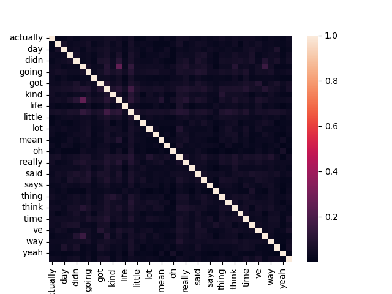
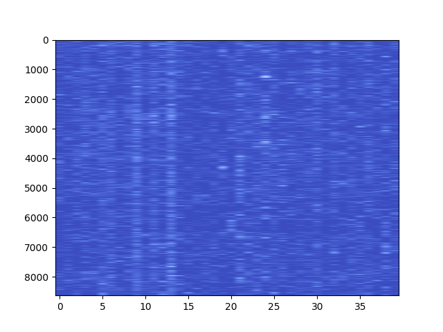

# Enhanced TF-IDF

**Description:** This repository includes an enhanced version of TfidfVectorizer that is defined in [scikit-learn](https://scikit-learn.org/stable/modules/generated/sklearn.feature_extraction.text.TfidfVectorizer.html).


## New Features

- **Extra Preprocessing Techniques:** removing punctuations, removing digits.

- **Extra Tokenizers:** NLTK lemmatizatizer and stemmer is adopted to the structure.

- **Read and Write Operations:** Data read and write methods are already implemented.

- **Visualizatons:** Two visualizations are available: Heatmap between documents and feature word occurrences and heatmap between the similarity distances of feature words.

- **Unit Tests:** Unit tests are added for individual model components to observe if a part fails after a specific change. 

**Note:** Please note that, already-existng features of the `scikit-learn` module is also supported.


## Requirements

- tqdm
- nltk
- scikit-learn
- numpy
- pandas
- matplotlib (for visualizations)
- seaborn (for visualizations)
- pytest (for running unit tests)

You can install all the packages by running `pip3 install -r requirements.txt`.

## How To Run

- **Training:**

```
# To train, run the following script (check run.py) aguments for optional parameters:
    python3 run.py -tc [TRAIN_CORPUS_TXT_PATH] -vc [VAL_CORPUS_TXT_PATH_IF_EXISTS]
```

- **Testing:**

```
pytest test.py
```

## Sample Results

- [Podcast Transcripts Dataset](https://www.kaggle.com/datasets/shuyangli94/this-american-life-podcast-transcriptsalignments?resource=download)

```python
# [INFO] Running the script with ops --> Lower No_Digit ASCII_Strip Stop_Words No_Punctuation

# Feature Names:

['actually', 'come', 'day', 'did', 'didn', 'don', 'going', 'good', 'got', 'just', 'kind', 'know', 'life', 'like', 'little', 'll', 'lot', 'make', 'mean', 'new', 'oh', 'people', 'really', 'right', 'said', 'say', 'says', 'story', 'thing', 'things', 'think', 'thought', 'time', 'told', 've', 'want', 'way', 'went', 'yeah', 'years']
```

**Similarity of Images:**



**Document-Word Heatmap:**

